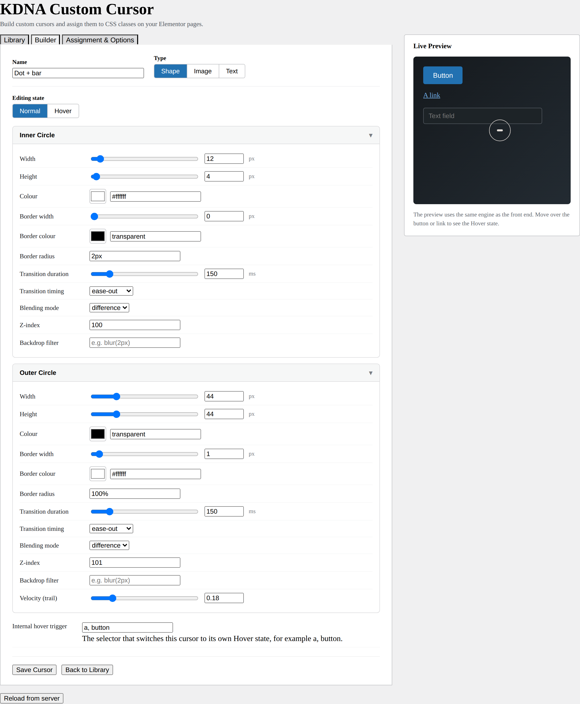
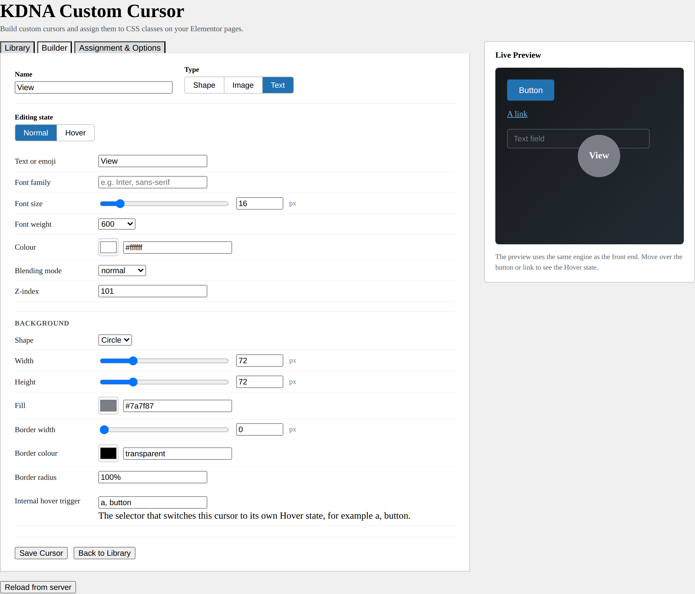
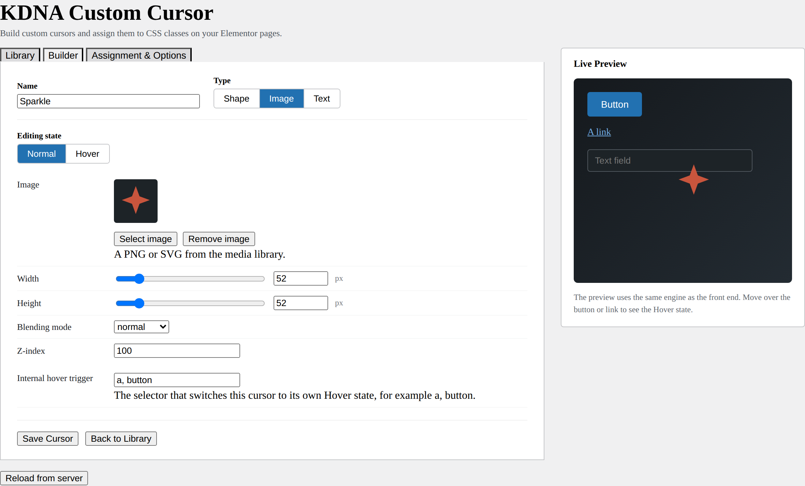
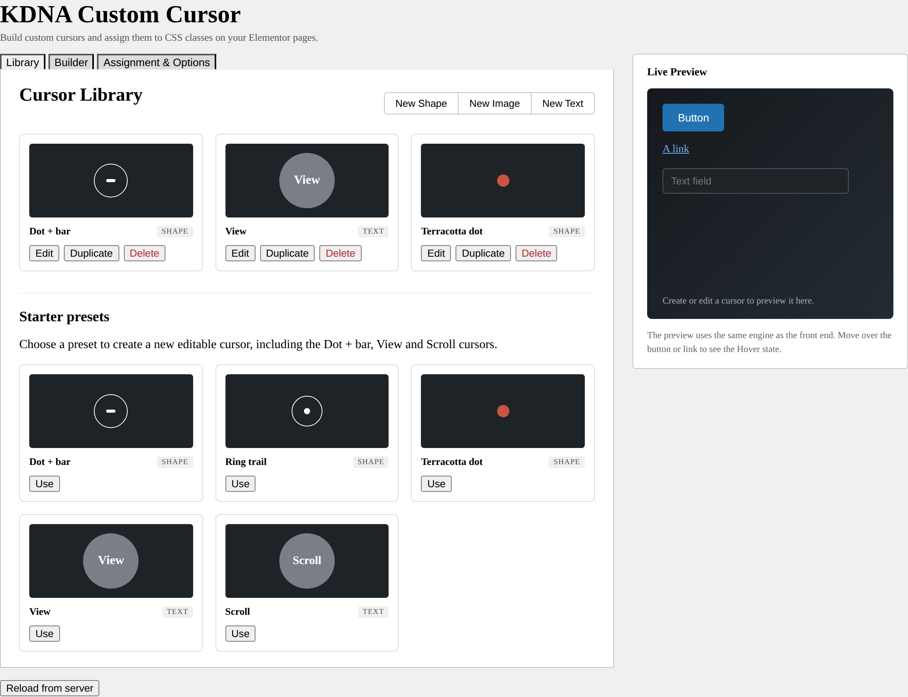
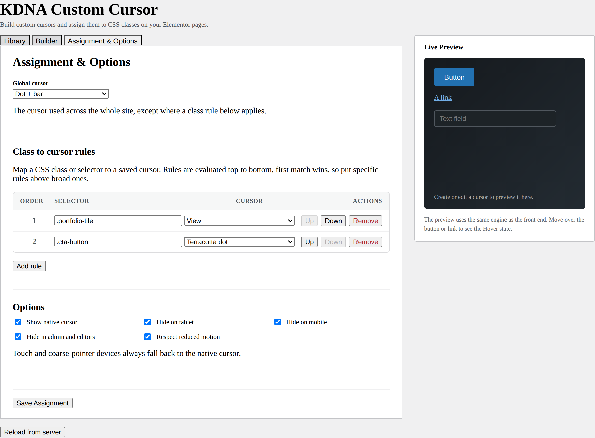
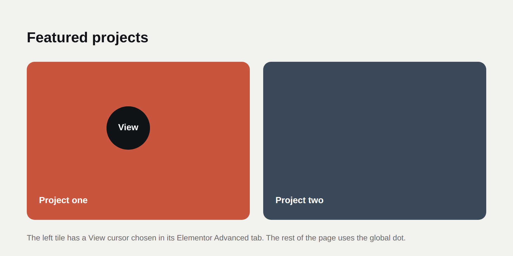
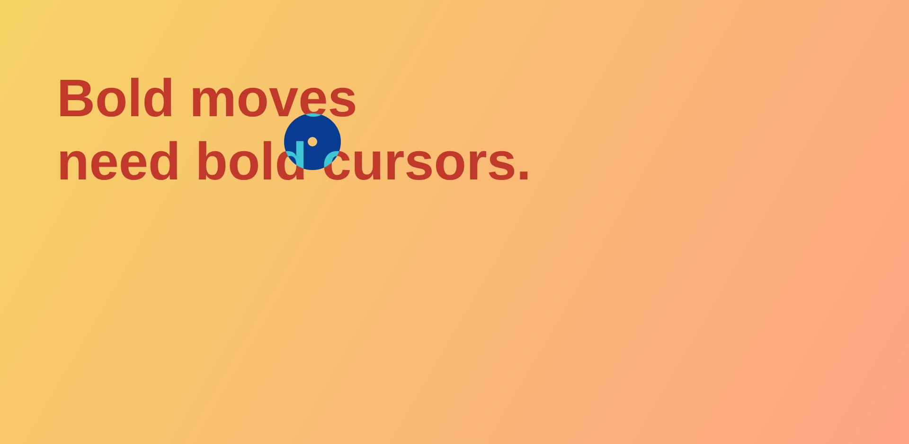
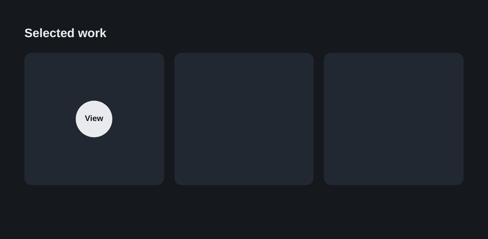

# KDNA Custom Cursor

### User Guide

Version 1.0.0

A custom cursor builder for WordPress and Elementor, with a per-class assignment model. Build animated mouse cursors in the WordPress admin and assign them to specific CSS classes on your pages, with an optional site-wide global cursor.

---

## Contents

1. What this plugin does
2. Requirements
3. Installing and activating
4. The settings page at a glance
5. Quick start in five minutes
6. Cursor types
7. Building a Shape cursor
8. Building a Text cursor (the View and Scroll style)
9. Building an Image cursor
10. Normal and Hover states
11. The control reference
12. The Library and the starter presets
13. Assignment: the global cursor and class rules
14. Options and accessibility
15. The Elementor Advanced-tab picker
16. How it behaves on the front end
17. Dynamic content
18. Recipes
19. Troubleshooting
20. Updating and uninstalling

---

## 1. What this plugin does

A cursor here is a small animated layer that follows the mouse pointer, typically an inner shape plus a larger outer ring that lags behind for a trailing effect, often with a blend mode so it inverts against whatever sits underneath.

The heart of the plugin is **per-class assignment**. You save a library of cursors, then map each one to a CSS class. When the pointer moves over an element carrying that class, the active cursor fully swaps to the cursor mapped to it. An optional global cursor covers everything else.

You can build three kinds of cursor:

- **Shape** cursors, an inner shape plus an outer ring.
- **Image** cursors, an uploaded PNG or SVG.
- **Text** cursors, a word or emoji, with an optional circular or pill background, so labels like **View** and **Scroll** are possible.

Each cursor has its own **Normal** and **Hover** state, and the live preview shows exactly what visitors will see.

---

## 2. Requirements

- WordPress 6.0 or later.
- PHP 7.4 or later.
- A mouse or trackpad. Cursors are a pointer behaviour, so they never apply on touch-only devices.
- Elementor is optional. The plugin works with any theme using the class method. Elementor only adds the friendlier Advanced-tab picker described in section 15.

There is no build step, no npm, and no dependency on WooCommerce. The admin uses Alpine.js (bundled), and the front-end engine is vanilla JavaScript.

---

## 3. Installing and activating

1. In the WordPress admin go to **Plugins**, then **Add New**, then **Upload Plugin**.
2. Choose the file `kdna-custom-cursor-1.0.0.zip` and select **Install Now**.
3. Select **Activate**.
4. Open **Settings**, then **KDNA Custom Cursor** to start building.

The plugin stores its data in two WordPress options and creates no custom database tables. Deleting the plugin removes its data cleanly.

---

## 4. The settings page at a glance

Everything lives on one page at **Settings**, then **KDNA Custom Cursor**. It has three tabs and a sticky live preview pane on the right.

- **Library**, your saved cursors and the starter presets.
- **Builder**, where you design a cursor.
- **Assignment & Options**, where you choose the global cursor, map classes to cursors, and set the option toggles.

The **Live Preview** on the right contains a Button, a Link and a text field. It runs the same engine as the front end, so what you see while building matches what visitors see. Move the pointer over the preview to bring the cursor in, and over the button or link to see the Hover state.

---

## 5. Quick start in five minutes

1. Open **Settings**, then **KDNA Custom Cursor**.
2. On the **Library** tab, scroll to **Starter presets** and select **Use** under **Dot + bar**. The Builder opens with an editable copy.
3. Move the pointer over the Live Preview to watch the cursor follow it. Adjust a control or two to taste.
4. Give it a clear **Name** if you wish, then select **Save Cursor**.
5. Go to **Assignment & Options**. Set the **Global cursor** dropdown to your new cursor.
6. Select **Save Assignment**.
7. Visit the front end of your site and move the mouse. Your cursor is live.

To make a cursor appear only on certain elements rather than everywhere, use the class rules in section 13.

---

## 6. Cursor types

Choose the type at the top of the Builder. The type selector switches the controls below it. Switching type keeps the values you entered for the other types, so you can experiment freely.

| Type | What it is | Typical use |
| --- | --- | --- |
| Shape | An inner shape and an outer ring, each fully styleable | A dot with a trailing ring, an inverting blend cursor |
| Image | An uploaded PNG or SVG that follows the pointer | A logo, an icon, a hand-drawn marker |
| Text | A word or emoji, with an optional circle or pill background | View and Scroll labels, an emoji pointer |

Every type supports a Normal and a Hover state and works as the global cursor and as a per-class mapped cursor.

---

## 7. Building a Shape cursor

A Shape cursor has two layers. The **Inner Circle** is locked to the pointer. The **Outer Circle** trails behind it, with the amount of lag set by the Velocity control.



To build one:

1. On the **Builder** tab, set **Type** to **Shape**.
2. Open the **Inner Circle** panel and set its size, colour and shape. For a dot, use equal Width and Height with Border radius `100%`. For a bar or dash, use a wide, short size with a small radius.
3. Open the **Outer Circle** panel and style the trailing ring. A transparent fill with a thin border makes a classic outline ring.
4. Set **Velocity (trail)** on the outer layer. `0` locks it to the pointer, higher values give more lag and a longer trail.
5. Optionally set a **Blending mode** of `difference` so the cursor inverts against the page beneath it.
6. Give the cursor a **Name** and select **Save Cursor**.

Each control updates the preview in real time. Border radius accepts `100%` for a circle, or a pixel value such as `8px` for rounded corners.

---

## 8. Building a Text cursor (the View and Scroll style)

A Text cursor shows a word or emoji. With a background shape it becomes a label sitting inside a filled circle or pill, the classic **View** and **Scroll** cursor.



To build a View label:

1. On the **Builder** tab, set **Type** to **Text**.
2. In **Text or emoji**, type `View`. You can use any word or an emoji such as a pointing hand.
3. Set the **Font size**, **Font weight** and **Colour** of the text. White text reads well on a dark circle.
4. Under **Background**, set **Shape** to **Circle**.
5. Set the circle **Width** and **Height** equal, for example `72` by `72`, and choose a **Fill** colour.
6. Optionally add a **Border width** and **Border colour**, and adjust the **Border radius**. A circle uses `100%`. For a pill, use a wider Width than Height and a large radius.
7. Name it **View** and select **Save Cursor**.

To make the matching **Scroll** cursor, the quickest route is to **Duplicate** the View cursor in the Library, then change its text to `Scroll`. The two starter presets already include both.

If you set **Shape** to **None**, the word floats with no background.

---

## 9. Building an Image cursor

An Image cursor is a single picture that follows the pointer.



To build one:

1. On the **Builder** tab, set **Type** to **Image**.
2. Select **Select image** and choose a PNG or SVG from the WordPress media library. The chosen image appears as a small preview.
3. Set the **Width** and **Height**. SVGs scale crisply at any size.
4. Optionally set a **Blending mode** and a **Z-index**.
5. Name it and select **Save Cursor**.

Use **Remove image** to clear the current picture and pick another. Transparent PNGs and SVGs work best, since the area around the artwork stays see-through.

---

## 10. Normal and Hover states

Every cursor has two states, switched by the **Editing state** toggle near the top of the Builder.

- **Normal** is the resting look.
- **Hover** is what the cursor changes to when the pointer is over a hover target inside it.

What counts as a hover target is set by the **Internal hover trigger** field at the bottom of the Builder. The default is `a, button`, meaning the cursor switches to its Hover state over links and buttons. You can use any CSS selector here.

While the **Editing state** toggle is set to **Hover**, the live preview shows the Hover look so you can style it directly. Set it back to **Normal** to edit the resting look. On the front end the cursor moves between the two states automatically as the pointer passes over hover targets, with a smooth transition whose speed is set by the **Transition duration** and **Transition timing** controls.

> Tip. Hover is a state *within* a cursor. It is different from the full cursor swap that happens when you move over a class-mapped element, which is covered in section 13.

---

## 11. The control reference

The Shape builder exposes the full set of controls for the inner and the outer layer, for both the Normal and the Hover state.

| Control | Applies to | Notes |
| --- | --- | --- |
| Width and Height | inner, outer, image, text background | Pixel sliders with a paired numeric entry |
| Colour | inner, outer, text | Named, hex or rgba, plus transparent |
| Border width and colour | inner, outer, text background | Pixels and a colour |
| Border radius | inner, outer, text background | `100%` gives a circle, or a pixel value |
| Transition duration and timing | shape layers | Milliseconds, with ease, ease-out, ease-in-out or linear |
| Blending mode | all | normal, difference, multiply, screen or exclusion |
| Velocity (trail) | outer | `0` locks to the pointer, higher gives more lag |
| Z-index | all | Stacking order, default 100 for inner and 101 for outer |
| Backdrop filter | shape layers | Optional, for example `blur(2px)` |

Colours accept a named colour, a hex value, an rgba value, or the keyword `transparent`. The colour swatch sets a hex value, and the text field next to it accepts the full range.

---

## 12. The Library and the starter presets

The **Library** tab lists your saved cursors as a grid, each with a small live thumbnail, its name and a type badge.



For each saved cursor you can:

- **Edit**, open it in the Builder.
- **Duplicate**, make an editable copy, handy for building a matched pair such as View and Scroll.
- **Delete**, remove it. You are asked to confirm first.

Below the saved cursors is **Starter presets**, a set of original KDNA cursors. Selecting **Use** on a preset creates a new, fully editable cursor from it and opens the Builder. The presets are:

- **Dot + bar**, a white dash with a trailing ring that inverts against the page.
- **Ring trail**, an outline ring with a small dot and a longer trail.
- **Terracotta dot**, a soft filled brand dot.
- **View** and **Scroll**, a word inside a solid circle.

Presets are templates. Using one never changes the preset itself, it gives you a copy to make your own.

You can also start from scratch with **New Shape**, **New Image** or **New Text** at the top of the Library.

---

## 13. Assignment: the global cursor and class rules

The **Assignment & Options** tab is where cursors meet your pages.



### The global cursor

The **Global cursor** dropdown sets one cursor for the whole site. Choose **None** to leave the native system cursor everywhere except where a rule below applies.

### Class to cursor rules

A rule maps a CSS class or selector to a saved cursor. When the pointer moves over any element matching that selector, the active cursor fully swaps to the mapped cursor. Leaving the element restores the global cursor, or the native cursor if no global is set.

To add a rule:

1. Select **Add rule**.
2. In **Selector**, type a class such as `.portfolio-tile`, or any CSS selector.
3. In **Cursor**, choose a saved cursor.
4. Select **Save Assignment**.

Rules are evaluated **top to bottom, first match wins**. Put specific rules above broad ones. For example, a `.portfolio-tile` rule above a `.section` rule means a tile inside a section uses the tile cursor, while the rest of the section uses the section cursor. Use the **Up** and **Down** buttons to reorder, and **Remove** to delete a rule.

### How to add a class to an element

In Elementor, select the element, open the **Advanced** tab, and add your class under **CSS Classes**, for example `portfolio-tile` (no dot). Then add a rule in the plugin mapping `.portfolio-tile` (with a dot) to your cursor. In other builders or themes, add the class however that tool allows.

The front end uses event delegation, so rules keep working for content that loads after the page, such as filtered grids and infinite scroll.

---

## 14. Options and accessibility

The **Options** block on the Assignment & Options tab controls where and when cursors run.

| Option | Effect when on |
| --- | --- |
| Show native cursor | Keeps the system cursor visible under the custom cursor. Turn off to hide it. |
| Hide on tablet | Does not run at tablet widths (768 to 1024 pixels). |
| Hide on mobile | Does not run at mobile widths (767 pixels and below). |
| Hide in admin and editors | Does not run inside the customizer or the Elementor editor preview. |
| Respect reduced motion | Falls back to the native cursor for visitors who request reduced motion. |

Two accessibility behaviours are always on, regardless of the toggles:

- **Touch and coarse-pointer devices** never initialise the cursor. Phones and tablets keep their native behaviour.
- Cursor layers are marked `aria-hidden` and never intercept clicks, so they do not affect screen readers or interaction.

---

## 15. The Elementor Advanced-tab picker

If you use Elementor, there is a friendlier alternative to typing a class. Every section, column, container and widget gains a **KDNA Custom Cursor** control in its **Advanced** tab.

1. Select an element in the Elementor editor.
2. Open the **Advanced** tab and find the **KDNA Custom Cursor** section.
3. Choose a saved cursor from the **Cursor** dropdown.
4. Update the page.

That element now shows your chosen cursor on the front end, with no class to type. Behind the scenes the plugin adds a generated class to the element and a matching rule for the engine, so it sits neatly alongside any manual class rules without conflicting with them. If an element has both a manual class rule and an Advanced-tab choice, the Advanced-tab choice wins for that element.

The image below shows the result. The left tile has a **View** cursor chosen in its Advanced tab, while the rest of the page uses the global dot.



---

## 16. How it behaves on the front end

The front-end engine is built for smoothness and good manners.

- Cursor layers are positioned with `transform` inside a single animation frame loop, with smoothing for the outer layer's trail. The loop stops itself when the pointer is idle and restarts on movement, so it costs nothing while the mouse is still.
- A **Blending mode** of `difference` makes the cursor invert against whatever sits beneath it, the effect shown below over a colourful background.
- Assets only load on pages where a cursor is actually configured.



A label cursor such as **View** mapped to a class produces the effect below, where the circle appears only over the mapped tile.



---

## 17. Dynamic content

Because the engine matches rules at the moment the pointer moves, cursors already work on content added after the page loads. If your theme or a script injects content under a stationary pointer and you want the cursor to update at once, dispatch the `kdna:content-added` event on the document:

```
document.dispatchEvent( new Event( 'kdna:content-added' ) );
```

The engine re-checks the rules for whatever now sits under the pointer and swaps the cursor immediately.

---

## 18. Recipes

### Dot + bar

A white dash that inverts against the page, with a trailing ring.

- Type Shape. Inner Width `12`, Height `4`, Colour white, Border radius `2px`, Blending mode `difference`.
- Outer Width `44`, Height `44`, Colour transparent, Border width `1`, Border colour white, Border radius `100%`, Blending mode `difference`, Velocity `0.18`.

### View on a circle

A label that sits inside a solid circle and shrinks slightly on hover.

- Type Text. Text `View`, Colour white, Font weight `600`.
- Background Shape Circle, Width `72`, Height `72`, Fill a mid grey.
- For the Hover state, set a slightly smaller circle, for example `58` by `58`.

### Site-wide subtle dot

A small dot with a gentle trailing ring for the whole site.

- Build a small Shape cursor, set it as the **Global cursor**, and leave the class rules empty.

---

## 19. Troubleshooting

**The cursor does not appear on the front end.**
Check that a **Global cursor** is set, or that a class rule matches an element on the page, then select **Save Assignment**. If you are testing on a phone or tablet, note that touch devices never show the cursor. Clear any caching plugin after saving.

**The cursor does not appear in the Elementor editor.**
That is expected when **Hide in admin and editors** is on. The cursor still appears on the live page.

**A class rule does not take effect.**
Make sure the selector in the rule includes the leading dot, for example `.portfolio-tile`, while the class on the element does not, for example `portfolio-tile`. Confirm the element actually carries the class by inspecting it in the browser.

**The blend mode looks wrong.**
Blending mixes the cursor with the colours beneath it. `difference` over a white area can look dark, and over a dark area can look light. That is the intended inverting behaviour. Switch to `normal` for a plain colour.

**The wrong cursor shows where two rules overlap.**
Rules are first match wins. Move the more specific rule above the broader one with the **Up** button.

**Nothing saves.**
Saving needs administrator rights. Make sure you are logged in as an administrator and that your session has not expired.

---

## 20. Updating and uninstalling

To update to a new build:

1. Deactivate and delete the old version under **Plugins**. Your saved cursors and settings are kept until the plugin is deleted, so to preserve them, update in place instead where possible.
2. Upload and activate the new ZIP.
3. If you use Elementor, go to **Elementor**, then **Tools**, then **Regenerate CSS & Data**.
4. Clear any caching plugin and do a hard refresh of the front end.

To remove the plugin completely, delete it from the **Plugins** screen. Deletion removes both plugin options and leaves no tables or stray data behind.

---

*KDNA Custom Cursor, version 1.0.0. Built for WordPress and Elementor.*
